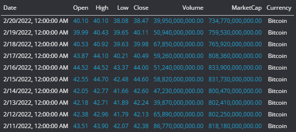
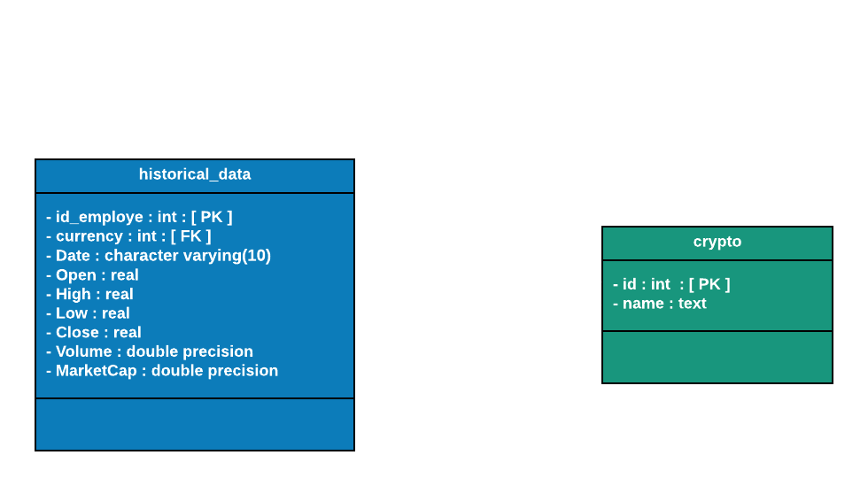

# CK-project

### A small programmes to scrape cryptocurency related web sites

This repository contains two small codes that will help you to start with the scraping methods.

# The Project 1 - Scraping cryptocurency historical information : 

## How to Use the Project : 1 ? 

1. The code that  you'll find here my dear friend will allow you to scrape the historical information about a cryptocurency of your choise on the web site : https://coincodex.com/
   
2. You will need to put the currency that you wanna know more about in a liste that you'll find in the code, it is a temporary methode, of course you can store it in your data base or create an app that will take the input that contains the name of the crypto.
   
3. Once it's done, and you did your choise, the code will scrape the pages with the information, then it will be cleaned with pandas library and stored in a  table like this one :

    

    *What does it mean ?*

    - Date: *date of observation*
    - Open: *Opening price on the given day*
    - High: *Highest price on the given day*
    - Low: *Lowest price on the given day*
    - Close: *Closing price on the given day*
    - Volume: *Volume of transactions on the given day*
    - Market Cap: *Market capitalization in USD*
 
### Data base UML Diagram

4. You also have a query to store the data in a database, in our case we are using postgres.
---
This is a first step project, you can add proxies to deal with web site blocks if you wanna adjust it for another website, put more security, divide the code and run on services, for exemple with Azure services, add some daily triggers to make it run automatically e.t.c.

---

## Main libraries :

- Selenium
- Python 
- Pandas
- ChromeDriverManager

## How to Install and Run the Project ? 

### Steps :

1. git clone < name of the repository >
2. Install dependencies with : !pip install -r requirements.txt
3. Add your database connecion information
4. Run all the cells 

*The code is in a jupyter notebook to let you see the steps, and analyse the code if you need*

Good luck !